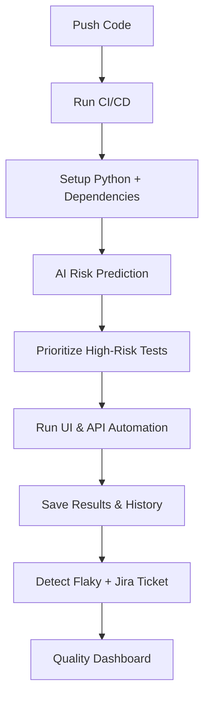

<h1 align="center">🚀 Intelligent QA Pipeline</h1>

<p align="center">
  <b>AI-Powered QA Automation with CI/CD + Jira Integration</b><br/>
  <i>Modern, Reliable, Scalable</i>
</p>

<p align="center">
  
  
  
  
  
</p>

---

## ✨ Features

- 🔮 **AI-Powered Risk Prediction** – Machine Learning predicts test failure risk  
- ⚡ **High-Risk First Execution** – Prioritize risky tests first  
- 🤖 **Automated UI Testing** – Playwright + Pytest (headless)  
- 🌐 **API Testing** – Postman + Newman CLI  
- 📊 **Quality Dashboard** – Trend analysis & metrics  
- 🕵️ **Flaky Test Detection** – Identify unstable tests  
- 🛠️ **Jira Integration** – Auto-create issues for failures  
- ☁️ **CI/CD on GitHub Actions** – Triggered on push  

---

## 📂 Project Structure

```text
intelligent-qa-pipeline/
├── .github/workflows/ci.yml        # CI/CD Pipeline
├── tests/                          # UI & API Tests
├── ai/                             # AI Models & Prediction
├── scripts/                        # Helper Scripts
├── postman/                        # API Collections
├── dashboard/                      # Quality Reports
├── jira-integration/               # Jira Integration
├── data/results/                   # Test Results
├── history/                        # Historical Reports
└── README.md                       # Project Documentation
```

---

## 🔄 Workflow Overview



---

## 🚀 Quickstart

### Local
```bash
# Activate virtual environment
source qa-env/bin/activate   # Linux/macOS
qa-env\Scripts\activate      # Windows

# Run all tests
pytest tests/ --json-report --json-report-file=data/results/pytest-report.json
```

### Cloud
> Automatically runs in **GitHub Actions** when you push to `main`.

---

## 📦 Artifacts

| Artifact | Content | Usage |
|----------|---------|-------|
| `test-results` | `pytest-report.json` | Debugging latest run |
| `test-history` | All `report_*.json` | AI training & trend analysis |

---

## 📅 Roadmap

- [ ] 🌐 Add Grafana dashboard  
- [ ] 🤖 Self-healing tests (auto-fix selectors)  
- [ ] 🔔 Slack/Discord notifications  
- [ ] 📈 Advanced analytics with Plotly  

---

## 🐍 Play With Me!

<div align="center">
  <picture>
    <source media="(prefers-color-scheme: dark)" srcset="dist/github-snake-3d-dark.svg" />
    <source media="(prefers-color-scheme: light)" srcset="dist/github-snake-light.svg" />
    
  </picture>
</div>


---

## 🙌 Author

AB7 a.k.a [**Badnation-137**](https://github.com/Badnation-137)
